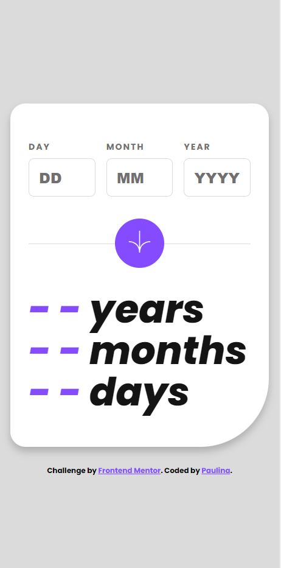
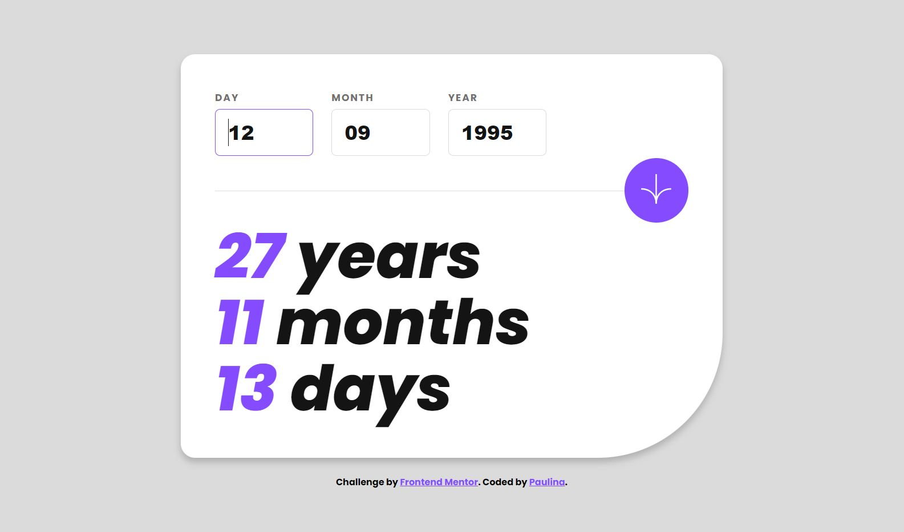
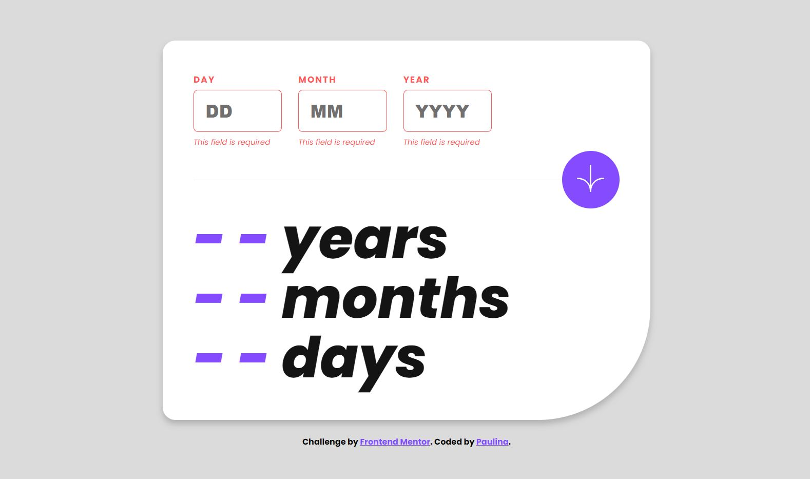
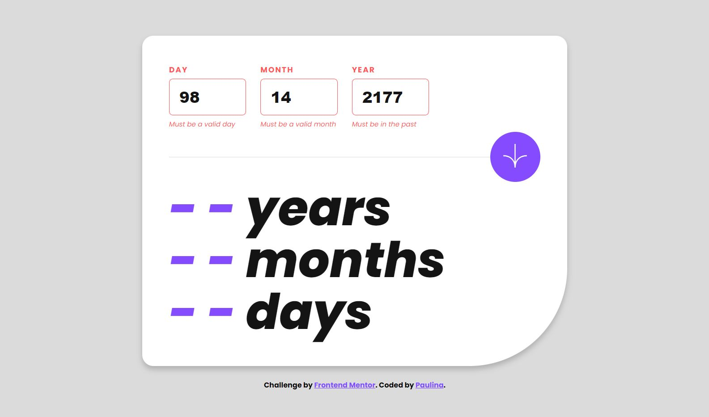
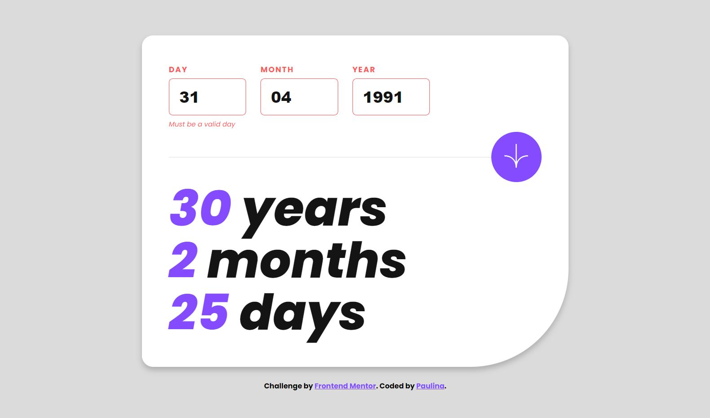

# Frontend Mentor - Age calculator app solution

This is a solution to the [Age calculator app challenge on Frontend Mentor](https://www.frontendmentor.io/challenges/age-calculator-app-dF9DFFpj-Q). Frontend Mentor challenges help you improve your coding skills by building realistic projects. 

## Table of contents

- [Overview](#overview)
  - [The challenge](#the-challenge)
  - [Screenshots](#screenshots)
  - [Link](#link)
- [My process](#my-process)
  - [Built with](#built-with)
  - [What I learned](#what-i-learned)

## Overview
The aim of this project was to create a responsive age calculator app. The primary functionality is to request users to input their birthdate and, once submitted, it showcases their age in terms of years, months, and days. The form is tailored to seamlessly adjust to different screen sizes, and it offers real-time feedback through visual cues and error messages, ensuring the data inputted by users is accurate.

### The challenge

Users should be able to:

- View an age in years, months, and days after submitting a valid date through the form
- Receive validation errors if:
  - Any field is empty when the form is submitted
  - The day number is not between 1-31
  - The month number is not between 1-12
  - The year is in the future
  - The date is invalid e.g. 31/04/1991 (there are 30 days in April)
- View the optimal layout for the interface depending on their device's screen size
- See hover and focus states for all interactive elements on the page
- **Bonus**: See the age numbers animate to their final number when the form is submitted

### Screenshots

### Link

- Live Site URL: https://age-calculator-app-pk.netlify.app/

## My process

The design was provided by Frontend Mentor. The structure of the form was built using semantic HTML5 markup, with a focus on accessibility. With the structure in place, I layered it with CSS styling, leveraging both grid and flexbox for the layout.

For responsiveness, I implemented CSS custom properties and media queries to modify the layout and fonts according to screen dimensions. 

The form's dynamic features, including real-time validation and age calculation, were achieved through JavaScript. I set up event listeners to track user inputs and ensure they were valid. I meticulously organized form elements for optimal user interaction. Emphasizing event handling, date validations were carried out using custom functions, providing immediate feedback. I further enhanced user experience with input restrictions and engaging animated age displays.

### Built with

- Semantic HTML5 markup
- CSS custom properties
- Flexbox
- CSS Grid
- Mobile-first workflow
- JavaScript 

### What I learned

This project was a significant learning opportunity for me in multiple areas. Through JavaScript, my understanding of form validation and live feedback deepened, especially in terms of real-time implementation. The challenge of presenting clear error messages for incorrect user inputs further honed my skills.

What is more, I enhanced my expertise in responsive design using tools like CSS grid and flexbox. This process unveiled innovative methods to develop adaptable layouts suitable for various screen sizes. Additionally, I explored the use of CSS custom properties, enabling me to dynamically tweak font sizes in accordance to screen dimensions.

To encapsulate, this project was a hands-on experience in creating a user-oriented form that effectively combined real-time validation with responsive design.

